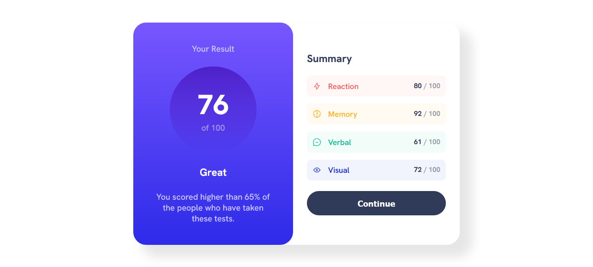
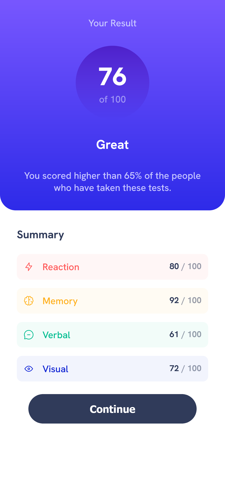

# Frontend Mentor - Results summary component solution

This is a solution to the [Results summary component challenge on Frontend Mentor](https://www.frontendmentor.io/challenges/results-summary-component-CE_K6s0maV). Frontend Mentor challenges help you improve your coding skills by building realistic projects.

## Table of contents

- [Overview](#overview)
  - [The challenge](#the-challenge)
  - [Screenshot](#screenshot)
  - [Links](#links)
- [My process](#my-process)
  - [Built with](#built-with)
  - [What I learned](#what-i-learned)
- [Author](#author)

## Overview

### The challenge


### Screenshot




### Links

- Solution URL: [Add solution URL here](https://your-solution-url.com)
- Live Site URL: [Add live site URL here](https://your-live-site-url.com)

## My process

### Built with

- Semantic HTML5 markup
- CSS custom properties
- Flexbox
- CSS Grid
- Mobile-first workflow

### What I learned

Building this project I was able to train HTML, CSS and even a little JavaScript.

```html
<div id="summary">
  <h2>Summary</h2>
  <ul>
    <li id="reaction">
      
      <p></p>
      <span></span><span>/ 100</span>
    </li>
  </ul>
</div>
```

```css
#summary {
  flex: 1;
  margin-left: 1rem;
}
```

```js
async function fetchData() {
  const res = await fetch('data.json');
  const data = await res.json();
  handleData(data);
}
```

## Author

- Website - [Felipe Manchester](https://www.linkedin.com/in/FelipeManchester)
- Frontend Mentor - [@yourusername](https://www.frontendmentor.io/profile/FelipeManchester)
